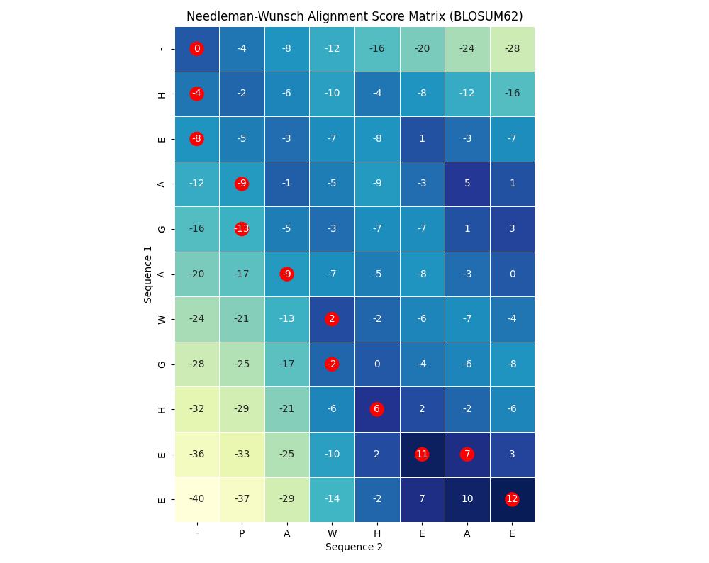

# 🧬 Needleman-Wunsch Aligner with BLOSUM62 + Heatmap

A Python-based global sequence alignment tool implementing the **Needleman-Wunsch algorithm** with **BLOSUM62 scoring** and a **heatmap visualization** of the dynamic programming matrix using `seaborn`.

---

## 📌 Features

- Global alignment using Needleman-Wunsch algorithm
- Customizable **gap penalty**
- Uses **BLOSUM62** matrix via Biopython
- Visualizes the scoring matrix as a **color-coded heatmap**
- Highlights the **traceback path** (optimal alignment route)
- Displays aligned sequences with match indicators (`|`)
- Export heatmap as `.png`
- Supports **FASTA-style output**
- Simple interactive prompts — no CLI required

---

## 🚀 Project Structure

NeedlemanWunschAligner/
├── Aligner.py              # Main Needleman-Wunsch alignment script with BLOSUM62 scoring
├── README.md               # Documentation for the project
├── example_output.png      # Sample output heatmap of the alignment matrix
└── sequences/              # Folder containing sample input sequences
    ├── sample1.txt
    └── sample2.txt

---

## 🧪 Sample Input/Output

### Example Input

Enter name for first sequence: Sequence 1
Enter first sequence: HEAGAWGHEE
Enter name for second sequence: Sequence 2
Enter second sequence: PAWHEAE

### Example Output

Final Alignment Score: 12

Aligned Sequences:
Seq1: HEAGAWGHE-E
          || || |
Seq2: --P-AW-HEAE

✅ Alignment saved to alignment.fasta

### Heatmap Output

<p align="center">
  
</p>

---

## 🧰 Dependencies

Make sure you have Python 3.7+ installed.

Install required libraries:

```bash
pip3 install biopython pandas seaborn matplotlib

```
---

## 📦 How to Use
1. Clone this repository:

```bash
git clone https://github.com/your-username/NeedlemanWunschAligner.git
cd NeedlemanWunschAligner

```
2. Run the program:

```bash
python3 Aligner.py

```
3. Follow on-screen input prompts.

4. A PNG heatmap of the alignment matrix will be saved as alignment_heatmap.png in the same directory.

---

## 📄 Output Format

+ Text alignment with match bars: Prints aligned sequences side-by-side with | for matches.

+ Heatmap PNG: Visual depiction of score matrix.

+ Optional (Advanced): Easily export aligned output in FASTA-style formatting.

---

## 🧠 How it Works

* Initializes a dynamic programming matrix using NumPy.

* Fills scores using BLOSUM62 substitution matrix.

* Traces the optimal alignment path using standard traceback rules.

* Constructs two aligned sequences with insertions (-) where needed.

* Highlights the traceback path on the heatmap with red circles.

---

## 🏷️ Tags

#Bioinformatics #Python #NeedlemanWunsch #GlobalAlignment #BLOSUM62 #Heatmap #SequenceAlignment #PortfolioProject #FASTA

---

## 👤 Contact

Arunannamalai Sujatha Bharath Raj

📧 [arun03bt@gmail.com]

🔗 https://www.linkedin.com/in/arunannamalai-sb-823351344/

🐙 https://github.com/Arun0364

---

## 📄 License

This project is licensed under the MIT License — see the LICENSE file for details.

---

## ❤️ Acknowledgments

Biopython for substitution matrices

Seaborn & Matplotlib for heatmaps

Classic Needleman-Wunsch algorithm (1970)


